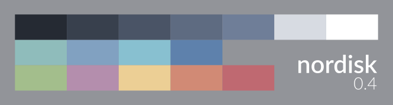

nordisk
=======

A dark, arctically bluish colour scheme for Vim and Lightline closely modelled on [Arctic Ice Studio’s Nord palette](https://github.com/arcticicestudio/nord).

fairly low contrast | unobtrusive | calm

Compared to the original, the first seven colours have been slightly modified; the remaining nine have only been reordered. Their functions have also been changed a little, though the overall aesthetic impression is quite similar.

### Screenshots

